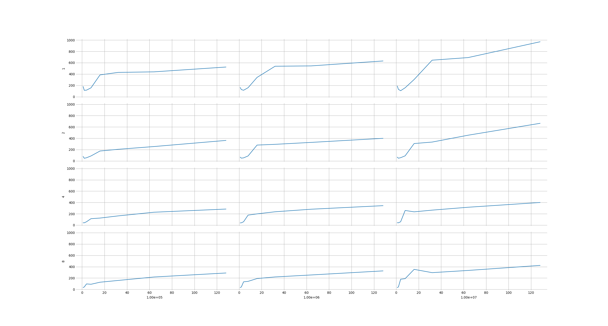
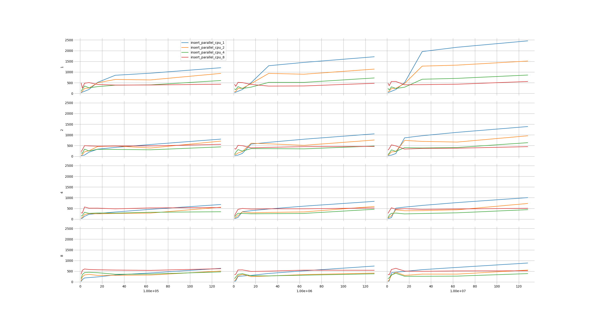
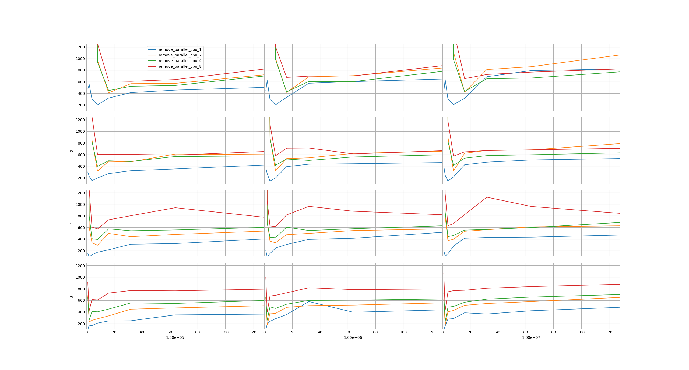
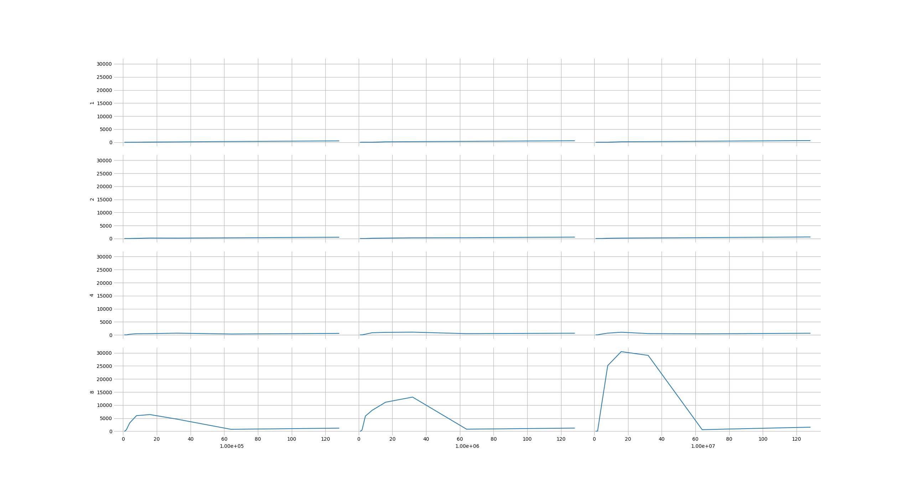
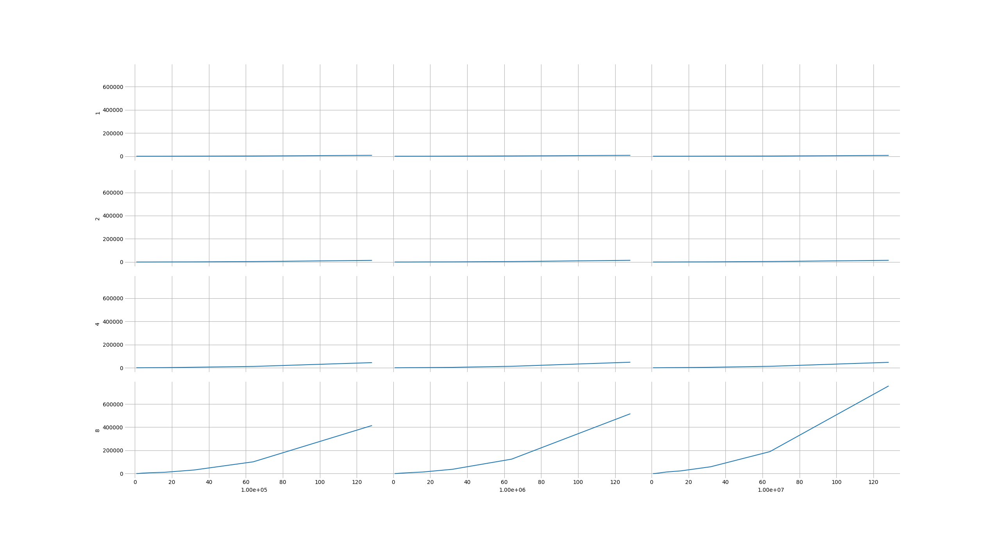

# PH-Tree implementation based on paper
Zäschke, Tilmann & Zimmerli, Christoph & Norrie, Moira. (2014). The PH-Tree - A Space-Efficient Storage Structure And Multi-Dimensional Index. Proceedings of the ACM SIGMOD International Conference on Management of Data. 397-408. 10.1145/2588555.2588564.

# Used 3rd party libraries
- https://github.com/Forceflow/libmorton

# Benchmarks
x-axis: tree depth/number of entries  
y-axis: dimensions/time (ns) per returned entry

**point query**
  
**insert**
  
**remove**
  
**rect intersect**
  
**knn query**
  

# Limitations
max dimensions = 32  
dimensions should be power of 2
